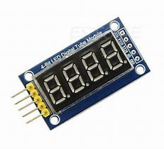

# TM1637
TM1637 LED display driver for TiJOS

| 条目       | 说明                            |
| ---------- | ------------------------------- |
| 驱动名称   | TM1637 四位数码管显示模块       |
| 适用       | 该驱动适用于TM1637 LED 显示模块 |
| 通讯方式   | GPIO                            |
| Java Class | TiTM1637.java                   |
| 图片       |       |

